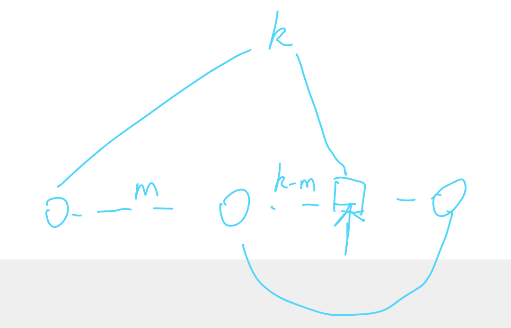

[题目链接](https://leetcode-cn.com/problems/c32eOV/)

#### 思路
+ 首先判断是否有环 快慢指针(注意写法)
+ 然后数出环的长度，就可以把问题转化成找出链表的倒数第k个结点
+ 然后双指针，一前一后

如何数出环的长度？在快慢指针相遇后固定一个，让另一个继续前进并计数，再次相遇后即可得到长度
代码注意一个细节就是我们在判断是否有环的的时候，如果两指针相遇，会返回相遇结点，这样方便后续数出环的长度
```java
class Solution {

    ListNode getNodeInLoop(ListNode head) {

        if (null == head || null == head.next)
            return null;

        ListNode slow = head.next, fast = slow.next;

        while (null != fast) {
            if (slow == fast)
                return fast;

            slow = slow.next;
            fast = fast.next;
            if (null != fast)
                fast = fast.next;
        }

        return null;
    }

    int getCycleSize(ListNode loopNode) {

        int size = 1;
        ListNode dummy = loopNode;
        loopNode = loopNode.next;

        while (dummy != loopNode) {
            size++;
            loopNode = loopNode.next;
        }
        return size;
    }

    public ListNode detectCycle(ListNode head) {

        ListNode loopNode = getNodeInLoop(head);
        if (null == loopNode)
            return null;

        int size = getCycleSize(loopNode);

        ListNode left = head, right = head;

        for (int i = 0; i < size; i++) {
            right = right.next;
        }

        while (left != right) {
            right = right.next;
            left = left.next;
        }

        return left;
    }
}

```

#### 简化
**在判断出有环后可以不必求出环的长度**


如图，假设快慢指针在方框结点相遇且slow走了k步，此时fast比slow多走了k步。那么如果此时让一个指针从head开始，一个指针从相遇结点开始，步速都是1，**那么他们一定会在方框结点再次相遇**,且在长度标为k-m的路段二者是相伴同行的，所以二者第一次相遇的点一定是环的开始点  
基于此想法，代码如下
```java
public class Solution {

    ListNode getNodeInLoop(ListNode head) {

        if (null == head || null == head.next)
            return null;

        ListNode slow = head.next, fast = slow.next;

        while (null != fast) {
            if (slow == fast)
                return fast;

            slow = slow.next;
            fast = fast.next;
            if (null != fast)
                fast = fast.next;
        }

        return null;
    }

    public ListNode detectCycle(ListNode head) {

        ListNode loopNode = getNodeInLoop(head);
        if (null == loopNode)
            return null;

        for (ListNode node = head; node != loopNode; node = node.next, loopNode = loopNode.next) ;

        return loopNode;
    }
}
```